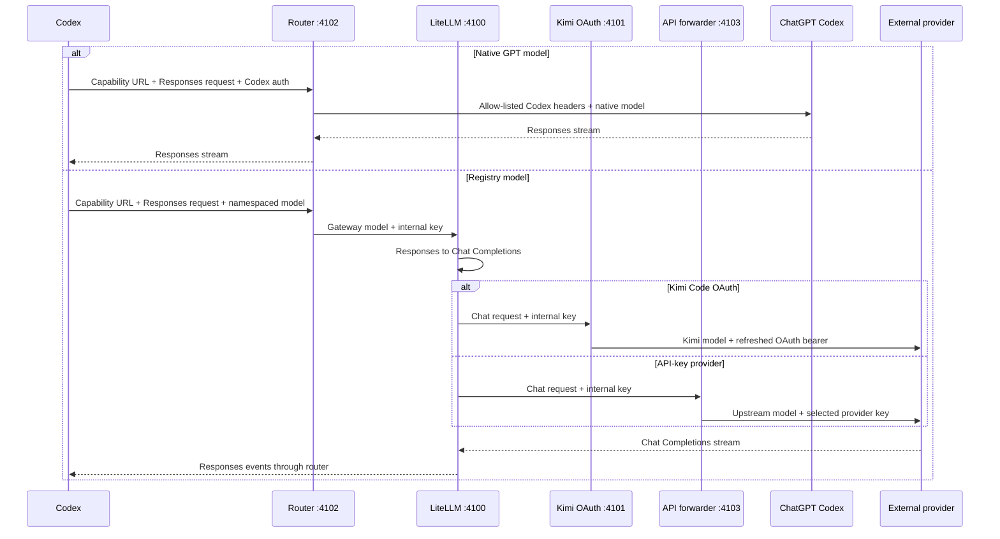

# How Nexus works

The provider core has one app frontend: Codex uses the Responses API and a
merged native catalog.

## Why a router is needed

The Codex App expects the Responses API and a Codex-shaped model catalog.
Kimi and DeepSeek expose OpenAI-compatible Chat Completions APIs with different
authentication and request details. Nexus bridges those contracts while
leaving native GPT traffic on the normal ChatGPT Codex backend.

Four pieces make the integration work:

- A generated catalog places external models beside native GPT models.
- A dispatcher chooses native or external routing by namespaced model ID.
- LiteLLM translates Responses requests, streams, and tool calls.
- Credential forwarders inject only the selected provider's authentication.

## Request flow

## One registry, multiple consumers

The split registry tree under `config/` supplies the model mapping used by the
catalog, router, gateway generator, API forwarder, and doctor.

`enabled-providers.json` is a separate local policy. It controls both picker
visibility and dispatcher access. A known namespaced model whose provider is
hidden receives a local `provider_not_enabled` error; it is never mistaken for a
native model or forwarded with Codex authentication. The policy is read on each
external request, so provider visibility can change without restarting the
service (Codex itself still needs a restart to reload the picker catalog).
Catalog generation also requires a stored credential or valid OAuth session for
each enabled external provider. Native GPT entries are included only when
`codex login status` confirms an OpenAI login, so signed-out login-free users see
only their authenticated external models.

Signed-out catalogs additionally alias external models onto native GPT slugs.
The ChatGPT desktop app's model menu filters `model/list` results against a
server-delivered allowlist of native slugs, so an external slug can never
appear there. Aliased entries reuse the allowlisted slugs while carrying the
external model's display name, description, and reasoning levels; each aliased
model also keeps a hidden entry under its canonical slug so routing, doctor
checks, and saved configs continue to resolve. `native-aliases.json` records
the slug mapping; the router consults it when dispatching `/responses`, and
`control model-set`/`auth-mode` write the alias slug into the Codex config so
pickers highlight the active model. Signed-in catalog builds clear the alias
map, which restores native GPT routing.

| Picker model | Public slug | Gateway model | Upstream model |
| --- | --- | --- | --- |
| K2.7 Coding Highspeed OAuth | `kimi-oauth/kimi-for-coding-highspeed` | `kimi-oauth-kimi-for-coding-highspeed` | `kimi-for-coding-highspeed` |
| K2.7 Coding OAuth | `kimi-oauth/kimi-for-coding` | `kimi-oauth-kimi-for-coding` | `kimi-for-coding` |
| Kimi K3 OAuth | `kimi-oauth/k3` | `kimi-oauth-k3` | `k3` |
| Kimi K3 API | `kimi-api/kimi-k3` | `kimi-api-k3` | `kimi-k3` |
| DeepSeek V4 Flash | `deepseek/deepseek-v4-flash` | `deepseek-v4-flash` | `deepseek-v4-flash` |
| DeepSeek V4 Pro | `deepseek/deepseek-v4-pro` | `deepseek-v4-pro` | `deepseek-v4-pro` |
| Grok 4.5 OAuth | `grok-oauth/grok-4.5` | `grok-oauth-grok-4-5` | `grok-4.5` |
| Grok 4.5 | `grok-api/grok-4.5` | `grok-api-grok-4-5` | `grok-4.5` |
| Claude Opus 4.8 | `anthropic-api/claude-opus-4.8` | `anthropic-api-claude-opus-4-8` | `claude-opus-4-8` |
| GLM-5.2 Ollama Cloud | `ollama-cloud/glm-5.2` | `ollama-cloud-glm-5-2` | `glm-5.2` |
| Kimi K2.7 Code Ollama Cloud | `ollama-cloud/kimi-k2.7-code` | `ollama-cloud-kimi-k2-7-code` | `kimi-k2.7-code` |
| MiniMax M3 Ollama Cloud | `ollama-cloud/minimax-m3` | `ollama-cloud-minimax-m3` | `minimax-m3` |
| DeepSeek V4 Pro Ollama Cloud | `ollama-cloud/deepseek-v4-pro` | `ollama-cloud-deepseek-v4-pro` | `deepseek-v4-pro` |
| Qwen3.7 Max Plan | `qwen-plan/qwen3.7-max` | `qwen-plan-qwen3-7-max` | `qwen3.7-max` |
| Qwen3.7 Plus Plan | `qwen-plan/qwen3.7-plus` | `qwen-plan-qwen3-7-plus` | `qwen3.7-plus` |
| GLM-5.2 Coding Plan | `zai-coding/glm-5.2` | `zai-coding-glm-5-2` | `glm-5.2` |
| GLM-5-Turbo Coding Plan | `zai-coding/glm-5-turbo` | `zai-coding-glm-5-turbo` | `glm-5-turbo` |

The native catalog objects are preserved rather than reconstructed, which keeps
current instructions and capability metadata from the installed Codex build.
Registry models clone a current native schema and replace picker-specific
metadata. They also rewrite the cloned GPT identity line in
`base_instructions` / `model_messages.instructions_template` so external models
do not claim to be based on GPT-5.

The integration deliberately keeps the built-in `openai` provider and points
it at a loopback `openai_base_url`. This makes named models appear in the normal
picker instead of replacing the provider with a generic `Custom` entry.

The same managed config also defines an inert `codex-router` custom provider.
The tray's login-free switch selects that provider for new Codex sessions, so
Codex can send Responses requests to the local router without first acquiring
OpenAI authentication. Model selection stays in the native Codex picker in
both modes: login-free catalogs alias external models onto native slugs, and
`control model-set` switches the active model from the command line. The switch snapshots the previous root
`model_provider` in protected state and restores it when disabled. It never
changes any ChatGPT credential. It keeps an already selected external model or
selects the first model from a connected, enabled provider, snapshots the prior
root model, and restores that model when disabled. External routes continue to
replace incoming authentication with only the chosen provider's credential.

The managed base URL contains a separate random caller capability. The router
validates it before reading a model request or contacting any upstream. Codex
cannot attach an arbitrary router-specific header to the built-in provider, so
the capability is carried in the URL path. Status, migration, and support tools
redact it, while Codex config and all snapshots are current-user-only files.
The router additionally requires JSON content, rejects browser-origin headers,
and never grants CORS access.

## Credential boundaries

| Route | Incoming Codex credential | Upstream credential |
| --- | --- | --- |
| Native GPT, image generation, and web search | Allow-listed and forwarded | Existing ChatGPT/Codex authentication |
| Kimi OAuth | Discarded | Kimi CLI OAuth bearer from `~/.kimi-code` |
| Kimi API | Discarded | Kimi Platform API key |
| DeepSeek | Discarded | DeepSeek API key |
| GitHub Copilot | Discarded | Stored fine-grained GitHub token, after Copilot entitlement and endpoint validation |

The Codex-to-router and internal-service trust boundaries use two different
random keys, each stored with mode `600` or a current-user Windows ACL. Neither
is a provider credential. Each external forwarder removes Codex account,
installation, attestation, and private headers before sending a request upstream.

GitHub Copilot adds one more credential boundary inside the shared API
forwarder. The stored fine-grained GitHub token is sent to GitHub's Copilot
account endpoint first, which validates entitlement and returns the account's
inference endpoint. That endpoint is accepted only when it resolves to a
GitHub-owned Copilot host, so account metadata cannot redirect the token to an
arbitrary server. The forwarder refreshes account routing once on a 401, before
relaying any response byte.

## Provider normalization

Kimi K3 API requests select `kimi-k3` and force maximum reasoning. Kimi Code
OAuth retains its own refresh and device-identity behavior.

DeepSeek V4 requests select the exact official upstream model, enable thinking,
and map Codex reasoning levels to DeepSeek's supported `high` and `max` values.
Sampling parameters that DeepSeek documents as ineffective in thinking mode are
removed. Both current V4 models use the same shared forwarder and credential.

The retired DeepSeek alias routes remain hidden registry entries. This keeps
old CLI commands working only as long as DeepSeek continues serving those
upstream aliases without advertising them to new users.

## Transport and compaction

Current Codex builds first attempt a Responses WebSocket. The router responds
with HTTP 426, and Codex falls back to HTTP. Request bodies may use Zstandard,
gzip, deflate, or Brotli; the router safely decompresses them before inspecting
the model ID.

Codex can compact history through `/responses/compact` or a
`compaction_trigger`. External Chat Completions providers cannot create OpenAI's
opaque encrypted compaction payload, so the router asks the selected external
model for a continuation summary and wraps it in a router-owned `kcr1:` payload.
On replay, it converts that payload back to a plain continuation message.

Standalone `/images/generations` and `/images/edits` requests always pass through
to the native OpenAI Codex backend with filtered Codex authentication headers.
They are never sent to an external model provider.

Commands, permissions, MCP tools, skills, and task state remain in Codex. Only
model inference and external-model compaction are routed.

Codex collaboration messages can place a delegated subagent task in native
OpenAI `encrypted_content`. External providers cannot read that opaque item. For
routed subagents only, the router uses the already-authenticated native Codex
backend to relay the exact task payload through a constrained function call,
replaces the opaque item with plaintext, and then sends the task to the selected
external model. Ordinary routed prompts do not use this relay.
The relay requires an active ChatGPT sign-in because only the native Codex
backend can open its own opaque payload. In login-free mode the router fails
closed instead of forwarding unreadable ciphertext to an external provider.

Only registry-proven models are advertised as native v2 spawn-agent overrides
by default. The Settings tab (desktop panel and macOS tray) exposes two local
accordions: **Subagent models** controls whether all selected models, or only
individually chosen models, are promoted to `multi_agent_version: "v2"` in the
merged catalog. The all-models mode follows the picker dynamically: a model
hidden from **Model picker** is not exposed as a subagent. Each accordion also
has select-all and unselect-all bulk actions. `bin/multi-agent on` still
promotes every picker-visible selected model, and `bin/multi-agent off`
restores the conservative set. The checked-in provider registry is never
changed by these switches.
